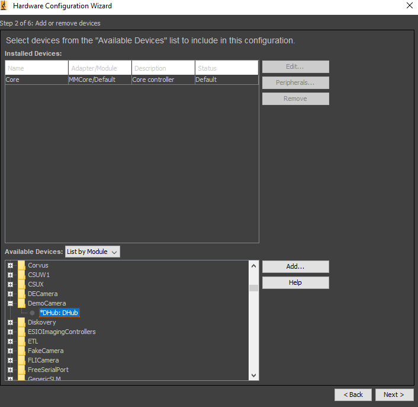
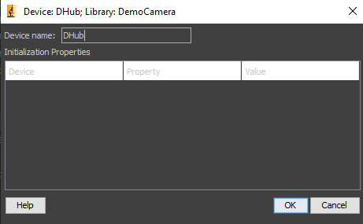
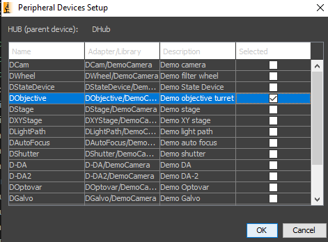
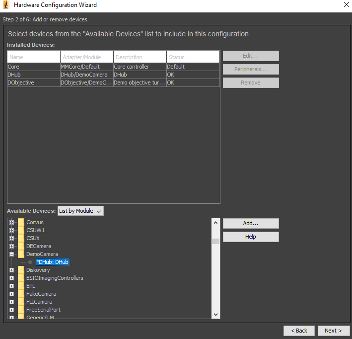
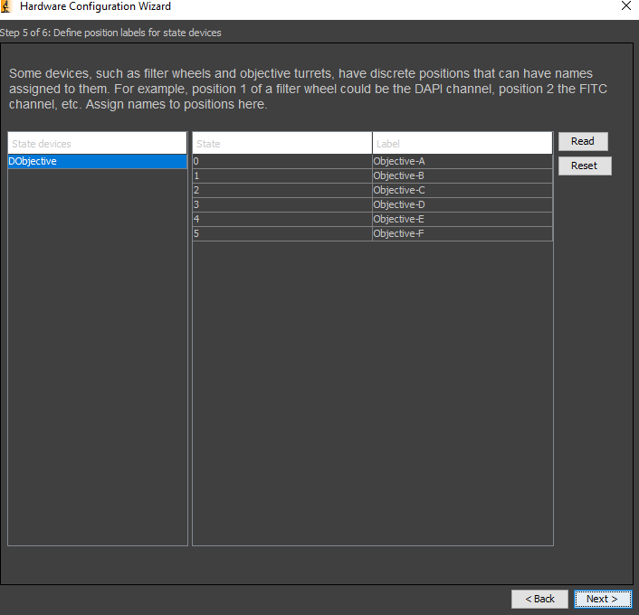
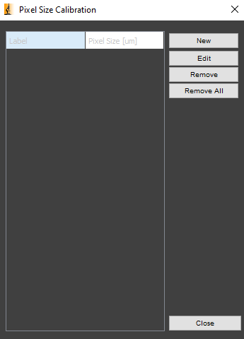
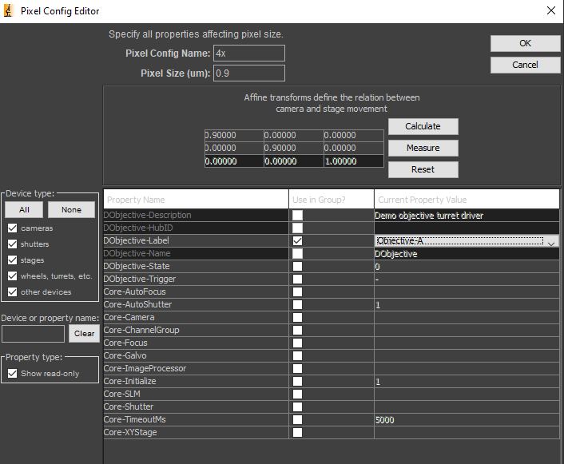
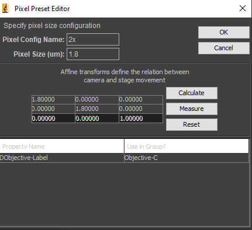
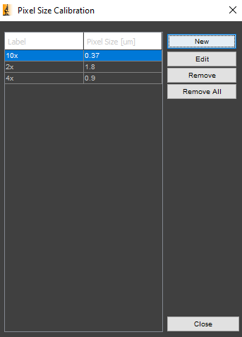
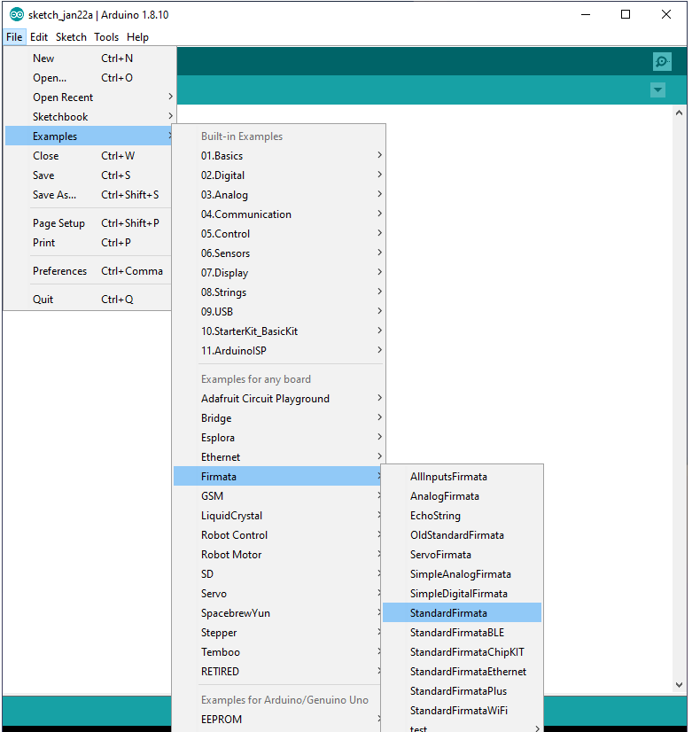

3D-MUSE-acquire
==========

Setting up the software
------------
Install micromanager nightly build from 20230530
https://download.micro-manager.org/nightly/2.0/Windows/

Choose the 20230530 from the list
MMSetup_64bit_2.0.1_20230530.exe

Install python 3.11 from Microsoft Store  
https://www.microsoft.com/store/productid/9NRWMJP3717K?ocid=pdpshare

Download a zip of this repository  
https://github.com/ckolluru/3D-MUSE-acquire/archive/refs/heads/master.zip

Unzip the contents of this zip file and move it to a suitable folder location.    

For simply running the software, Visual Studio code is not required. If you want to set up a development environment and make changes to the code, then you need Visual Studio Code  and Git.   

Install Visual Studio Code   
https://code.visualstudio.com/

Install Git   
https://git-scm.com/download/win

Open Visual Studio Code  

Click on the extensions button on the left, search for python, and install the extension. This is not a python interpreter, this just allows visual studio to format and display python code properly. The python interpreter is installed on the system using the steps mentioned above (from Microsoft Store).  

Set the default terminal profile. Press Ctrl + Shift + P. Search for Terminal: Select Default Profile. Select the command line.

Now go to File > Open Folder. Select the folder with this code that was unzipped. You should see all the files in the explorer tab on the left. Open main.py file and pin it.  

Now on the menu bar, select terminal > new terminal. In the terminal window, run the pip install command below. The requirements.txt file has a list of all python libraries that the software depends on.
```
pip install -r requirements.txt
```

If you are not setting up Git and Visual Studio Code, open command prompt. Navigate to the folder containing this code.  
Run the same pip install command.
```
pip install -r requirements.txt
```

Setting up micromanager
------------
In Micromanager, a configuration file is created to connect to the specific hardware. Open Micromanager and select (none) in the configuration window.  

Go to devices > hardware configuration wizard and follow the steps from the micromanager Zaber device pages, to set up the XYZ stages. Select spinnaker camera and find the blackfly camera you are using, and set it up as well. The status should say OK.  We also set up DemoCamera (DHub) and select the Demo Objective (this is a dummy item that lets us specify an objective magnification)<br><br>


<br>Select ok on this window<br><br>


<br>Select the Demo Objective<br><br>


<br>You should see a DHub and DObjective devices setup<br><br>


Leave defaults on steps 3 and 4. In step 3, it may leave the focus stage direction empty, select positive towards the sample if that is the case. In step 5, it should show you a table of states and labels for the demo objective turret. Leave it as is.<br><br>


Save the configuration file in a suitable location, preferably in the same folder as this repository. Next, we will enter the pixel size values for each of the objectives. Go to Devices > Pixel Size Calibration, and select New. Click OK on the warning window where it says devices will move<br><br>


Give a suitable name in the pixel config editor (say 4x), enter pixel size (um), and click on the calculate button. The 3x3 affine transform will be updated based on the pixel size. Select the DObjective-Label for the use in group checkbox. The python code assumes that the 4x is objective-A, 10x is objective-B, 2x is objective-C. Select the current property value appropriately from the dropdown in DObjective-Label row<br><br>


<br>Repeat this process for all the objectives you need, use the appropriate objective names<br>
<br><br>


<br>When you close this window above, it will ask to save this pixel configuration to the same device cfg file, it is OK to overwrite. Now, when the objective magnification is used from this software's dropdown, Micromanager will automatically be updated. See the bottom most line in the micromanager window, where it says

Image info (from camera), Image intensity range, xyz nm/px

<br>Ensure that xyz is the number you expect.  

Modifications based on COM ports
------------
Ensure that the COM port for the Arduino is correctly entered. It is hardcoded for now.
In main.py, go to the ```initialize_arduino()``` function. Change the line as needed.  

```
self.board = pyfirmata.Arduino(str("COM5"))
```

Arduino should run the standard firmata code to communicate with pyfirmata library in python. Open Arduino IDE, select the board and COM port.  
Upload this code from the examples to the board.<br>


Other hardcoded items in the code
------------

Assume that sectioning is always at 3 microns. If not, change this line in main.py.  
```
z_thickness = 3 * (skipEvery + 1)
````

Assume that the limits for the X and Y stages are fixed. If this changes, change these lines in main.py
```
x_stage_max = 25400
y_stage_max = 20000
```

Assume that one sectioning cycle takes less than 25 seconds to complete. If not, change these lines with an appropriate time.  

imaging_module.py (two places)
```
if time.time() - self.last_cutting_time > 25:
  break
```
<br>trimming_module.py (one place)
```
if time.time() - last_cutting_time > 25:
  break
```    

Running the software
------------
Go to ```bin\``` folder and run the batch script  ```3D-MUSE-acquire.bat```
- It will start a command window, do not close that at any time when using the application.    

Software screenshot
------------
<p align="center">
  
</p>

Getting help
------------
The Help tab > Instructions button on the application's  taskbar has useful information on how to use the software. It has information on how to keep a block in the microtome, how to clean the knife, how to set up a trimming cycle, how to do an imaging cycle, how to stop in between handling error situations and how to shutdown the system. The text below is all available from Help > Instructions button in the software.    

Setting up the microtome prior to initialization
------------
1. Ensure that the microtome is in the 3D mode by following the steps in the microtome user manual. The cut mode of the microtome should be set to single. Set the section thickness to 3 microns and the cutting speed to the first black line on the dial (corresponds to 0.5). The cutting angle of the knife should be 4 degrees.
2. Clamp the tissue block into the sample holder with the pointed edge oriented towards the knife. Tighten the vice clamp. If desired, the knife guard can be used to ensure that the knife does not touch the skin. After the block is clamped, the knife guard can be opened.
3. Retract the sample away from the knife edge. Next, carefully advance the sample forward towards the knife such that the sample is close to the knife edge but does not touch it. You should ensure that there is a visible gap by eye between the knife edge and the sample. The handwheel on the microtome is always turned clockwise. 
4. Clean the edge of the knife using a brush to ensure that it is free of debris. Use a styrofoam stick and knife cleaning fluid to wipe any additional debris on the knife. The stick should be held at an angle of 45 degrees and gently moved over the knife. Do not apply too much pressure as this may damage the knife. Always keep track of knife usage as knives are changed in the system. 
IMPORTANT: It is advised to either move the knife to a fresh edge or place a new knife every 2-3 samples (10,000 to 15,000 cuts).
5. Ensure that the fan is properly aligned towards the block. This is required to remove sections sticking to the block surface after a cut. A vibration isolation pad is used to reduce vibrations from the fan on to the imaging system. The fan speed is set to 1.


Setting up the imaging system prior to initialization
------------
1. Switch on the power supply to the light source and the motorized XYZ stages. Connect the USB cables for the camera and Arduino to their designated slots on the acquisition computer. USB connections from the XYZ stages are always connected to the computer.
CAUTION: When the Arduino is connected to the computer, the digital pins are reset (go from high to low), which will cause a cutting cycle to occur. It is thus important to pull the sample block away from the knife initially to ensure that the knife is not damaged.
2. Open MicroManager and choose the pycromanager.cfg configuration file. This will launch the MicroManager window.
3. If not already done, run the 3D-MUSE-acquire software. It is available as a batch script on the desktop or can be run if the software repository is set up in Visual Studio Code. You are already running it if you are seeing this in the Help > Instructions tab.
4. Click the initialize Arduino button. This will establish the connection between the python acquisition software and the Arduino. When done, the initialize Arduino button will be greyed out since you need to do this only once per run of the software.
CAUTION: This operation will also reset the digital pins on the Arduino (go from high to low), which will cause a cutting cycle to occur. It is thus important to pull the sample block away from the knife initially to ensure that the knife is not damaged. If cutting was occurring previously, this will cause one section to be cut.
5. If the XYZ stages were rebooted, it is necessary to home the stages to their zero positions. Press the home stages button. This operation will take a while, but when done, the home stages button will be greyed out.

Steps for trimming
------------
1. When a resin block is placed on the microtome, the block may need to be sectioned first to expose the nerve surface. We refer to this process as trimming.
2. Enter the desired folder location for storing the image stack. A log file will be created in this location during the session with useful debug information.
3. Enter the number of cuts desired in the corresponding text box. Each cut will be 3 µm thick, unless the sectioning thickness was changed on the microtome control panel. Thus, if 1 mm of the sample needs to be cut, enter 333 cuts. Ensure that the switch on light source checkbox is off. 
CAUTION: Do not provide more cuts than what is physically possible. It is useful to measure the length of the block with a scale and ensure that the cutting does not extend into the yellow resin portion of the block.
4. Ensure that the trim the block – do not collect images checkbox is checked. Other properties in the acquisition window are not relevant for trimming and will be disregarded.

Steps for imaging
------------
1. We will set up tiles for imaging prior to running an imaging session. The tile set up is done primarily in Micromanager software. However, we set the exposure time text box in the acquisition software to a suitable value, around 200 ms. 
2. Click the Live button in Micromanager to open a live view window, displaying the current image from the camera. An additional window labeled “Inspect-Preview” is also shown with the histogram of the current image. Click on the full scale button to ensure that the live view is mapping the image intensities correctly. 
3. Open the Stage control window in Micromanager. Use the stage window to move around the sample, changing the move step sizes on the stage window if required. There are three step sizes available (>, >>, >>>). Each arrow can be configured to take a step of a certain distance. Do not change the X and Y distances for the field with three arrows (>>>) unless the objective lens has been changed. This is because these numbers are important when setting up tiles. When using tiles with 20% overlap, the distance in the >>> field should be 2800 µm in X and 2100 µm in Y for the 4x objective. For the 10x objective, it should be 1100 µm in X and 888 µm in Y.
4. When panning around the sample to view the nerve, ensure that the switch on light source checkbox is selected (this is the only case when you need to check this box manually, an imaging session will automatically switch the light source on and off as required). 
5. The image can be window/leveled if the brightness is not optimal. The window level and gamma settings are available directly on the histogram in the Inspect Preview window. If the brightness is too high, the exposure can be reduced to 100 ms. In general, blocks are usually brighter in the center than at the edge, so it is not an issue if the first image is slightly dark, and the histogram is primarily in the lower half. Intensity normalization methods can be applied later if desired.
6. To set up tiles, open the Multi D acquisition tab in MicroManager, and select Edit Position list. Open the stage control window as well if not already open. Pan around the sample and focus on the block as desired. If the sample is not visible, you may need to run another trimming session. Moving along the Z stage will help with focusing. 
7. If nerve is completely visible (full cross-section), use the create grid option in the Edit Position list window. There is a box that says overlap, change it from um (default) to %. Set the overlap to 20%, ensure the pixel size is correct (0.9 µm if you are using the 4x objective, 0.37 µm if you are using the 10x objective). If they are incorrect, these values can be changed in Objective configuration and preset Objective-A (4x) and Objective-B (10x) in the main window of MicroManager. 
8. In the Create Grid window, set the individual corners as desired. The step distance with the >>> in the stage window is now useful, since one step by >>> will move the stage by amount that is slightly less than a tile (80%). This will let you set up perfect tiles (one >>> step in X and one >>> step in Y and setting the appropriate top, left, bottom and right corners will result in the creation of a 2x2 grid). As described earlier, for the 4x objective, this distance >>> should be 2800 µm in X and 2100 µm in Y. For 10x objective, it should be 1100 µm in X and 888 µm in Y.
IMPORTANT: When setting up tiles, make sure that the tiles will be sufficient for the full length of the nerve. For example, if the nerve is oriented such that it moves downward in the block, it may be useful to set up 2 tiles in the Y direction and 1 tile in X direction.
9. Select OK on the grid creator window, now you should see positions populate in the MDA window. Click the go to button after selecting each tile position and focus using the Z stage control as required. Click the Merge button and then the Merge with current Stage position. This will ensure that each tile is set up with the best focus position. Save the positions to a file with a suitable name in the same directory as the storage directory. If the first image acquisition is to be captured, save the file as PositionList_1.pos. If 3 acquisitions are already captured in the folder, save the file as PositionList_4.pos. This will ensure easy loading of positions later if required. This may be needed if the python acquisition software closes due to an error and the acquisition does not change to Finished in Micromanager. MicroManager and the acquisition software would need to be restarted in that case, and having the position list saved to a file is extremely useful to ensure the same tile setup between runs.
10. Ensure that the correct objective magnification is selected from the dropdown box in the acquisition software. Two objective options are currently provided, 4x and 10x. MicroManager should automatically recognize the correct pixel sizes to use.
11. Set number of cuts as desired. If stitching is needed, it will be done automatically and saved in a separate directory in the same storage folder. 
CAUTION: Do not provide more cuts than what is physically possible. It is useful to measure the length of the block with a scale and ensure that the cutting does not extend into the yellow resin portion of the block.
12. If desired, an autofocus algorithm can be run at intermediate slices. Add an appropriate value to that line item. Usually autofocus every 5 images is sufficient. If the value is set to zero autofocus is not performed, if the value is 1 autofocus is done on all images.
13. Images can be skipped between sections. Add an appropriate value in the corresponding text box. If 0, no images are skipped. In general, if every fifth slice needs to be imaged, the skip image option can be set to four.
14. If desired a z-stack can be setup at each tile. This is suitable when working with an objective with a low depth of focus, e.g, 10x 0.45 NA. Individual slices in a z-stack are automatically stitched and merged into a single image. If Z start is set to -3, Z stop is set to 3, and Z step is set to 1, the software will collect images at z-3, z-2, z-1, z, z+1, z+2, and z+3 microns. The seven resultant images will be stitched to create a single image. This algorithm is currently being implemented, so please set these three values to zeros for now.
15. Uncheck switch on light source and trim the block – do not collect images options. 
16. Stop the live view in micromanager.
17. Click start acquisition button. A progress bar and status message box will be updated during each cutting and imaging event.

Stopping and restarting imaging
------------
For trimming and acquisition cycle, the stop acquisition button will work to stop the session. It will be noted in the log file as to how many cuts were taken.
If there is an error in the program, this software may shut down. You can relaunch the software and try running again.
If the block was being imaged when this software crashes, the acquisition window displaying the images in MicroManager may say "(Running)" in the top left bar of the acquisition window. In tha case, Micromanager would need to be closed and restarted. You will need to set the tile positions again in the Multi D acquisition window. It is easy to load in the position file again if you saved it earlier.
There is no "pause" option in the software. You stop and start acquisition as desired.
To shutdown, switch off microtome, cover the knife guard. Switch off power supply to xyz stages and light source. Disconnect the arduino and camera cables. Close this software and turn off PC.
